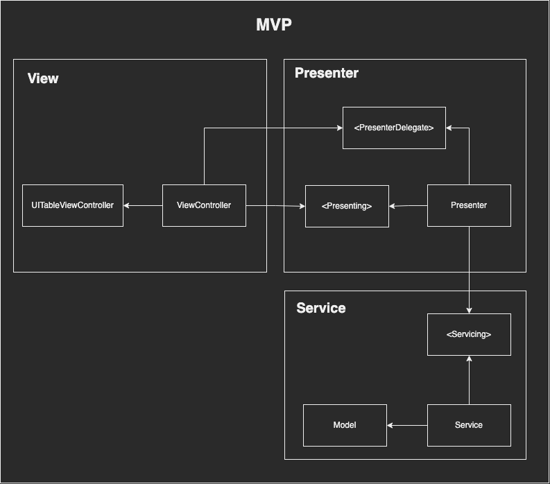
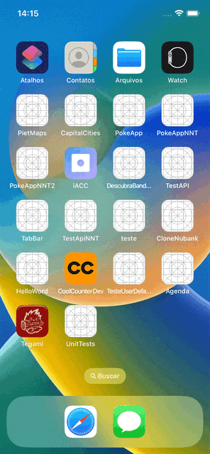

# UnitTests

Um projetinho iOS que usa Design Pattern de UI MVP para mostrar uma forma bem legal de criar testes unitários. Neste projetinho a única classe testada foi a Presenter, mas fica o desafio para você em criar os testes para todas as camadas.

# Design Pattern de UI - MVP

# Demo

